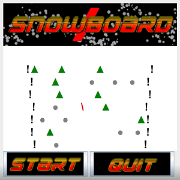

<div class="ui small rounded images">
  
</div>

The snowboard project in highschool was for my final project in AP Computer Science Principles and was meant to represent all of what I learned throughout the school year. I decided to go with java as I had enough experience in it through another AP Computer Science course I took the same year. The game was basically a "SkiFree" clone that most people have played on windows XP at one point or another. I put my own twist on it as I chose to use a snowboard instead of skis and go with a simpler art style. I also didn't include a yeti which I realise now was a missed oppritunity.   

I worked alone on this project and this is probably where I really had my eyes opened to the power of programming. I realized while doing this project about how all of the pieces I had learned through the year clicked together. I realized I could use arrays as a storage for each proceedurally generated line and I also learned the importance of google while working on any project. A lot of googling was done but I was given a lengthy time frame to complete the project and a decent bit of help in class thanks to my teacher.

Here is some code that illustrates how we read values from the line sensors:

```js
SwingWorker<Void, String> worker = new SwingWorker<Void, String>(){
            @Override 
            protected Void doInBackground() throws Exception{
                
                boolean dead = false;
                
                while(ingame == true)
                {
                    String all = "";
                    //Moves character based on orientation
                    if(playerString.equals("\\")){
                        player++;
                    }
                    else if(playerString.equals("/")){
                        player--;
                    }
                    //Iterate through each row in the window in each iteration
                    for(int j = currentRow; j < windowRow +currentRow; j++)
                    {
                        String currentLine = "";
                        //Ierates through each column
                        for(int o = 0; o< windowCol; o++)
                        {
                            //If same location as player
                            if(j == center && o == player){
                                //if player is on rock tree or edge they die
                                if(env[j][o].equals("<span style=\"color:gray\">&#9679;</span>") || env[j][o].equals("<span style=\"color:green\">&#9650;</span>") || env[j][o].equals("<span style=\"color:black\">!</span>")){
                                    //sets character model to X and ends the game
                                    currentLine = currentLine+"<span style=\"color:red\">X</span>";
                                    dead = true;
                                    ingame = false;
                                }
                                else{
                                    //Setting player orientation to current location
                                    currentLine = currentLine + "<span style=\"color:red\">"+playerString+"</span>";
                                }
                            }
                            else if(dead == true && j == (windowRow+currentRow-1)){
                                // Game over line set
                                currentLine = "<span style=\"color:black;font: bold 24px arial, sans-serif;\">Game Over</span>";
                            }
                            else{
                                //creates new line for current row
                                currentLine = currentLine + env[j][o];
                            }
                        }
                        //If you hit the final line, you win appears
                        if(j == 55){
                            currentLine = "<span style=\"color:black;font: bold 24px arial, sans-serif;\">You Win!</span>";
                        }
                        
                        //Taking current line into a new line in the game string
                        all = all + "<br>"+currentLine;
                        
                    }
                    //Increment the row and center up
                    currentRow++;       
                    center++;
                    System.out.println("Row is "+currentRow);
                    //SwingWorker sends final string to publish class for UI updating
                    publish(all);
                    //Waits to allow gameplay
                    Thread.sleep(600);
                    //Ends game if finsish line is passed
                    if(currentRow == 50) ingame = false; 
                }
                //Returns null since void
                return null;
            }
```


