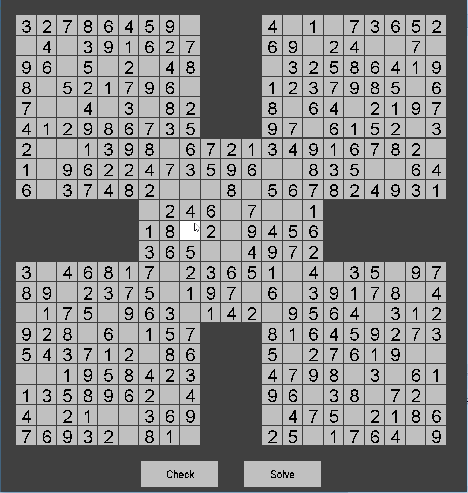

My team and I created a fairly sophisticated sudoku game for ICS 111 last year. This was my first dip into the world of complex algorithms as we needed to solve sudoku boards, both normal and samurai mode, after creating them so it could tell the user if they were correct with their solution of the board. (Samurai "easy" mode pictured above) Each game type had a easy, normal, and hard mode that would have less spots pre-filled the more difficult it got.

Sudoku was where I learned and tought my team on how to use GitHub. I spent an afternoon or two learning Github and then taught it to my team so that we could have effective version control. That is especially important when dealing with complex Samurai mode solving algorithms

Source: <a href="https://https://joelsikkink.github.io/Project3/"><i class="large github icon"></i>Sudoku</a>
