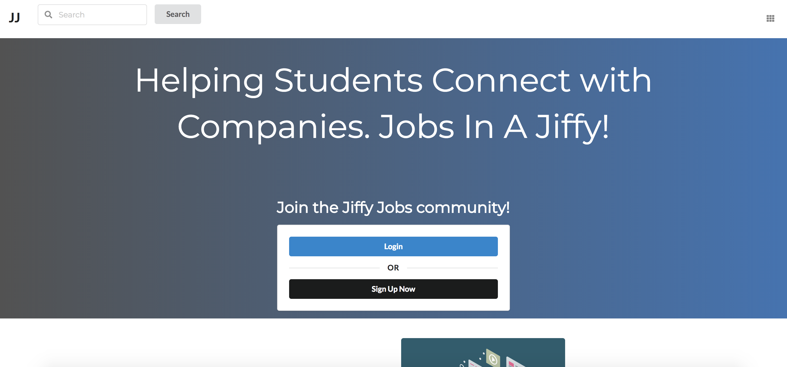

During the last few weeks of this semester I've worked with my group to create our very own Jiffy Jobs website. The idea of the website was to make an easy way for students and employers to find each other in and out of college without hassle. The project overall went well and as a group we got most of what we set out to accomplish done however we did have to leave out some features due to the time constraint. I am pretty proud of what we created and for the most part the site was functional. The part I'm most proud of completing was the account creation system that flawlessly integrated with the other parts of the site. 

The project was a great learning experience and taught me many valuable lessons that I can apply to my further education and career. Teamwork on projects like these require good communication which I feel we did well. It also requires good version control which I feel we handled exceptionally well with our use of Github and the milestone/issue system. Learning the basics of creating a functional site was also very important as I had to apply more than just what I learned in class. 

Source: <a href="https://jiffy-jobs.github.io/"><i class="large github icon"></i>Jiffy Jobs</a> 

